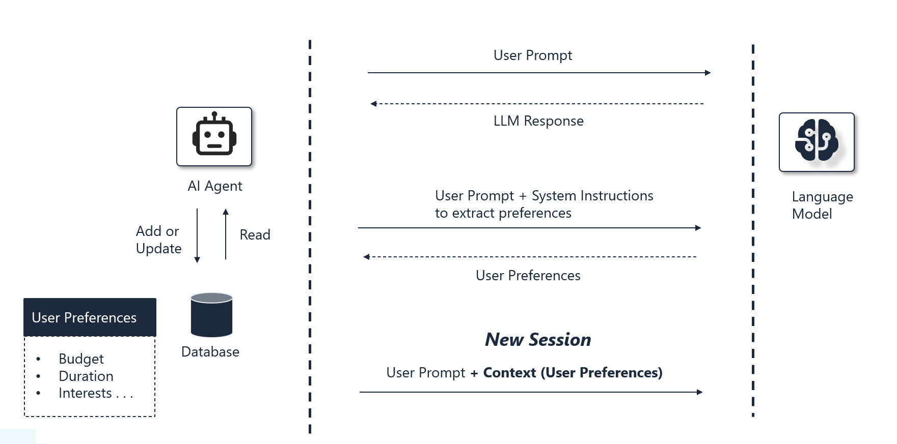

# Lab 1: Personalization using Long-Term Memory

> **Duration**: ~20 minutes

Welcome to your first hands-on lab! In this lab, you will add **long-term memory** to your agent, enabling it to remember user preferences across sessions and learn from conversations over time.

You will implement a bidirectional memory system that both reads stored profiles and extracts new preferences from conversation, creating personalized experiences.

By the end of this lab, you will:

- ✅ Understand long-term memory in AI agents
- ✅ Implement profile injection using AI Context Providers
- ✅ Enable automatic preference extraction from conversation

---

## Understanding Long-Term Memory

**Long-term memory** in AI agents refers to information that persists across sessions, stored externally (databases, files) rather than in the conversation context.

Without long-term memory:
```text
Session 1: User shares preferences (budget, interests, dietary needs)
Session 2: Agent asks the same questions again ❌
``` 

With long-term memory:
```text
Session 1: User shares preferences → Stored
Session 2: Agent: "Based on your hiking interests and $2000 budget..." ✅
```

---

## How it works



**Profile Injection (Reading Memory):**

1. User sends a prompt requesting travel recommendations
2. Before the LLM processes the request, AI Context Provider loads the user profile from Cosmos DB
3. Profile data (preferences, budget, interests, past trips) is injected into the conversation context
4. LLM generates personalized responses based on stored preferences

**Dynamic Learning (Writing Memory):**

1. User shares new preferences during conversation (e.g., "I love hiking")
2. After the LLM responds, AI Context Provider analyzes the conversation
3. LLM extracts new preferences and updates from the conversation
4. Updated profile is merged with existing data and saved to Cosmos DB
5. Future conversations automatically use the enriched profile

---

## Instructions

### Part A:  Profile Injection

Let's start by implementing read-only profile memory.

#### Step 1: Review the User Profile Model

Open `src/backend/Models/UserProfileMemory.cs` to review the structure of the user profile. This model defines the information we will store about each user, such as their travel style, budget, interests, and past trips.

#### Step 2: Understand the AI Context Provider Pattern

Open `src/backend/Services/UserProfileMemoryProvider.cs`. This class implements `AIContextProvider`, which allows us to inject custom context into the agent's reasoning process.

```csharp
public class UserProfileMemoryProvider : AIContextProvider
{
    // Called BEFORE sending messages to the LLM
    public async Task ProvideAIContextAsync(
        AIContext context, 
        CancellationToken cancellationToken)
    {
    }

    // Called AFTER receiving LLM response
    public async Task StoreAIContextAsync(
        AIContext context, 
        CancellationToken cancellationToken)
    {
    }
}
```

#### Step 3: Enable Profile Memory in Agent

Open `src/backend/Agents/ContosoTravelAgentBuilder.cs` and add the `UserProfileMemoryProvider` to the agent configuration. This will enable the agent to have access to user profile information during reasoning.

```csharp
public Task<AIAgent> CreateAsync()
{
    var agent = _chatClient.CreateAIAgent(new ChatClientAgentOptions
    {
        // Existing code omitted for brevity


        // Add this section:
        AIContextProviders = [
                new UserProfileMemoryProvider(
            _chatClient,
            _cosmosDatabase!,
            _config.CosmosDbUserProfileContainer ?? "UserProfiles",
            new UserProfileMemoryProviderScope
            {
                UserId = userId,
                ApplicationId = Constants.ApplicationId
            },
            loggerFactory: _loggerFactory)]


        // Existing code omitted for brevity
        
    }); 
 
}
```

---

### Part B: Dynamic Memory - Learning From Conversation

Now let's review how the agent can learn and update user preferences dynamically from conversation.

#### Step 4: Understand the Extraction Mechanism

Open `src/backend/Services/UserProfileMemoryProvider.cs` and review the `StoreAIContextAsync` method. This is called after the agent responds to the user.

**How Dynamic Extraction Works:**

1. After the agent responds to the user, `StoreAIContextAsync` is called automatically.
2. The recent conversation may have new preferences or information shared by the user (e.g., "I love hiking and outdoor activities"). We can use the LLM to extract this information from the conversation.
3. The LLM analyzes the conversation and identifies any new preferences or updates to the user's profile. It returns a structured profile update.
4. The new profile information is merged with the existing profile and saved back to Cosmos DB. The latest profile is now available for future conversations, allowing the agent to adapt and personalize responses over time.

## Test Your Implementation

Refer to the **[Running the Application Locally](00-setup_instructions.md#running-the-application-locally)** section in the Environment Setup guide to start the application.

### Test Scenarios: Personalization and Learning

Try out the agent's ability to remember your preferences and provide personalized recommendations.

**Step 1: Build Your Profile**

Start a conversation with:

```
Can you help me plan a trip?
```

*Expected:* The agent asks about your preferences (budget, travel style, interests).

**Step 2: Share Your Preferences**

Respond with your details:

```
I want to plan a trip with a budget of around $2,000. I love hiking and outdoor activities.
```

*Expected:* The agent provides tailored destination recommendations and stores your profile (travel style, budget, interests, past trips).

**Step 3: Test Memory Persistence**

Start a **New Chat** and ask:

```
I want to plan my next vacation
```

*Expected:* The agent recalls your stored preferences and provides personalized recommendations without asking for them again.

---

## Next Steps

👉 **[Lab 2: Conversation Recall with Episodic Memory](02-lab-episodic-memory.md)**

---
