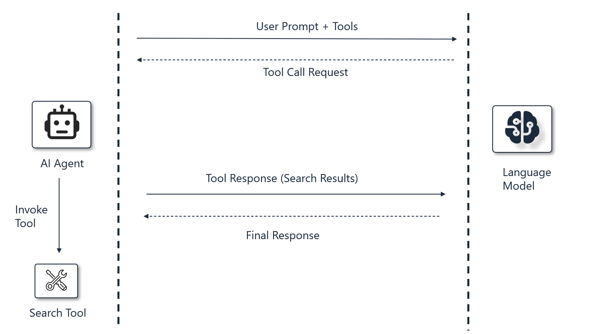

# Lab 2: Conversation Recall with Episodic Memory

> **Duration**: ~20 minutes

In this lab, you will enable your agent to recall past conversations using **episodic memory**.

You will enable your agent to remember previous interactions, bookings, and preferences across sessions. By the end of this lab, you will:

- ✅ Learn how conversation history is stored with vector embeddings
- ✅ Implement conversation recall using vector search in Cosmos DB

---

## Understanding Episodic Memory

**Episodic memory** in AI agents refers to the system's ability to recall specific past interactions and events. This allows the agents to answer questions like: "What bookings did I make?" or "What recommendations did you give me last time?"

---

## How it works



  1. User sends a prompt referencing past conversations. For example: "Where did I travel last year?"
  2. LLM decides to invoke the SearchChatHistory tool
  3. The tool uses an embedding model to generate a vector representation of the query
  4. Vector search is performed against stored chat history in Cosmos DB
  5. The most relevant past messages are retrieved and returned to the LLM
  6. LLM uses this context to generate a personalized response based on conversation history

---

## Instructions

### Step 1: Understand Chat History Storage

Open `scripts/seed-cosmosdb/Program.cs` and review how chat history messages are stored with embeddings.

Notice that each conversation message gets:

- A vector embedding of the content
- Metadata like UserId, ThreadId.

### Step 2: Review the Chat History Search Tool

Open `src/backend/Tools/ChatHistorySearchTool.cs` and review the implementation.

This tool:

- Takes a natural language query about past conversations
- Generates an embedding for the query
- Performs vector search against chat history in Cosmos DB to find relevant past messages
- Returns the most relevant past messages grouped by conversation thread

Notice how the tool description guides the LLM on when to use it:
```csharp
[Description("Search past conversations to recall previous discussions, bookings, preferences, and interactions...")]
```

### Step 3: Add Query Enrichment

Query enrichment improves search recall by extracting entities and adding related terms before vector search.

**Example transformation:**
```
User: "Tell me about my Sydney trip"
→ Basic query: "Sydney trip"
→ Enriched query: "Sydney travel hotel flight accommodation booking activities"
```

Open `src/backend/Tools/ChatHistorySearchTool.cs` and locate the `SearchChatHistory` method.

Add enrichment before generating embeddings by replacing:

```csharp
  // Generate embedding for the enriched search query
  var embeddingResponse = await _embeddingClient.GenerateEmbeddingAsync(query);
```

With:

```csharp
  var enrichedQuery = await EnrichQueryAsync(query);
  _logger.LogInformation("[ChatHistorySearch] Enriched query: {EnrichedQuery}", enrichedQuery);
  // Generate embedding for the enriched search query
  var embeddingResponse = await _embeddingClient.GenerateEmbeddingAsync(enrichedQuery);
```

The `EnrichQueryAsync` method uses the LLM to extract entities and add semantically related travel terms, improving vector search recall.

### Step 4: Update Agent Configuration

Open src/backend/Agents/ContosoTravelAgentBuilder.cs and update the tools list to include the search tool in the agent configuration.

```csharp
Tools = [
    AIFunctionFactory.Create(
        _chatHistorySearchTool.SearchChatHistory,
        name: "SearchChatHistory",
        description: "Search past conversations to recall previous discussions and bookings")
]
```

### Step 5: Update the Prompt Instructions

Help the agent understand when to use the search tool by adding a ## TOOL USAGE section to the AgentInstructions constant.

```text
## TOOL USAGE
- **SearchChatHistory**: Use when user references past conversations ("last time", "remember when", 
  "previously"), asks about previous bookings or recommendations, or when context from conversation 
  history would help personalize responses.
```

---

## Test Your Implementation

Refer to the **[Running the Application Locally](00-setup_instructions.md#running-the-application-locally)** section in the Environment Setup guide to start the application.

### Test Scenarios: Conversation Recall

Try these queries to see how the agent recalls past interactions across different conversation threads.

**Example 1**

```
What bookings did I make?
```

*Expected:* The agent searches chat history and finds the previous bookings.

---

**Example 2**

```
What dining recommendations did you give?
```

*Expected:* The agent recalls previous restaurant recommendations.

---

## Next Steps

👉 **[Lab 3: Knowledge Retrieval with Semantic Memory](./03-lab-semantic-memory.md)**

---
