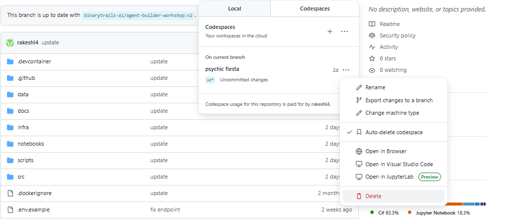

# Finishing Up

Congratulations on completing the workshop!

Here are some final steps to wrap up the session.

---

## Cleanup: Delete Azure Resources

To avoid ongoing charges, delete your Azure resource group.  

1. Open a terminal and navigate to the root of your project.
2. Run the following command:

    ```bash
    azd down
    ```
   
   You can alternatively delete the resource group using the Azure Portal:

- Go to the [Azure Portal](https://portal.azure.com)
- Click **Resource groups** in the left menu
- Select your resource group (e.g., `rg-aiagent-wks-dev`)  
- Click **Delete resource group**

---

## Save Your Changes to GitHub  

If you've made changes to the files, you can save them to your forked GitHub repository:

```bash
git add .
git commit -m "completed workshop changes"
git push origin main
```

---

## Delete Your GitHub Codespace  

If you used GitHub Codespaces:

1. Go to [github.com/codespaces](https://github.com/codespaces)
2. To the right of the codespace you want to delete, click **...**, then click **Delete**



---
