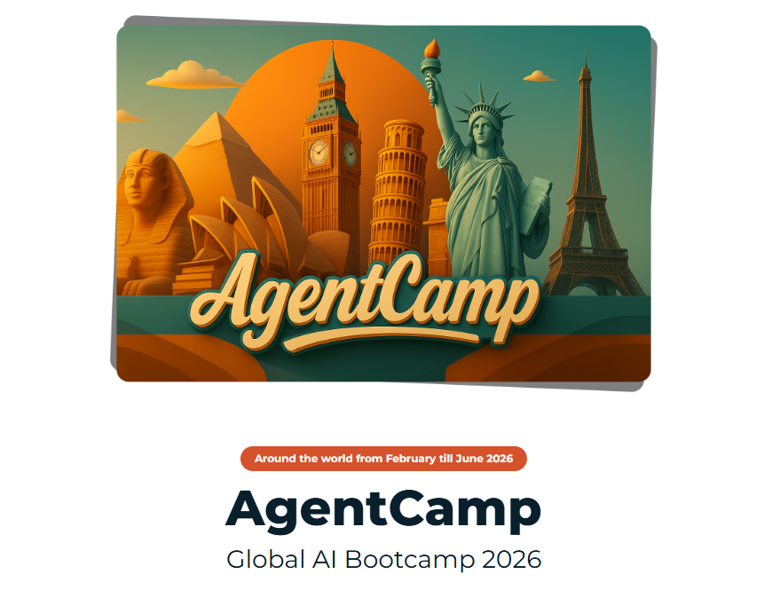
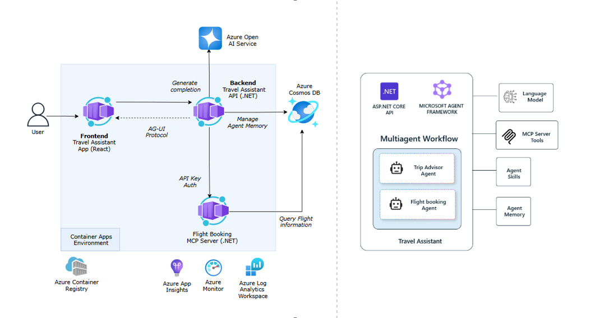

# Agents That Remember: Designing Memory-Driven AI Systems



## Session Information

The real power of an AI agent isn’t in the model. It’s in how well it manages context.

Large language models are inherently stateless. Without carefully designed memory and context strategies, agents lose track of goals, and struggle with long-running tasks.

In this practical workshop, we explore why context is the foundation of intelligent agent behavior — and how to design it intentionally.

We’ll explore the core memory types that shape agent behavior:

Short-term memory – working context for current reasoning loops
Long-term memory – persistent knowledge across sessions
Episodic memory – past interactions and task history
Semantic memory – structured knowledge about users or domains

Through progressive examples, we’ll evolve a simple stateless agent into a memory-driven system that maintains goal continuity, adapts over time, and produces more consistent decisions.

This session is not about adding complexity — it’s about designing stronger foundations.

By the end, you will walk away with:

✅ A clear understanding of different memory types and when to use each
✅ Practical patterns for structuring, storing, and retrieving memory effectively
✅ Architectural strategies for handling context window limits
✅ A reference implementation approach you can apply to your own agent builds

This session is designed for practitioners who have some experience working with AI models and basic programming knowledge.

---

## Application Overview

This repository provides a reference implementation of an AI-powered travel assistant built with the Microsoft Agent Framework. It demonstrates the following key capabilities:

!!! tip "New to the Microsoft Agent Framework?"
    Start with the foundation labs in [labs/00-foundations](https://github.com/binarytrails-ai/agentcamp-workshop/tree/main/labs/00-foundations).
    
    These standalone examples introduce core concepts of Microsoft Agent Framework in a simplified context.

---

## Architecture



### Key Components

- **Frontend (Container App)** - User interface built with CopilotKit to interact with the travel assistant agent.
- **Backend API (Container App)** - .NET 10 Asp.NET Core API that hosts the Travel Assistant agent. The API publishes the agent via the AG-UI protocol for frontend integration and manages agent execution, state, and tool interactions.
- **Cosmos DB** - Azure Cosmos DB instance for storing user preferences, and other application data.
- **Azure AI Foundry** - Provides access to Azure OpenAI models.
- **Observability** - OpenTelemetry for distributed tracing and Azure Monitor for centralized logging and monitoring of agent interactions.

---

## Let's Get Started

Head over to the [Environment Setup](./00-setup_instructions.md) page for instructions on setting up your development environment and running the travel assistant application. Once you have the application up and running, you can explore the following scenarios:

### Personalization with User Preferences

This scenario demonstrates how the agent stores and retrieves user preferences to provide personalized travel recommendations.

**Step 1: Initial Conversation - Building Profile**

Start the conversation with:

```
Can you help me plan a trip?
```

*Expected Response:* Agent greets you and asks about your travel preferences (e.g., budget, travel style, interests).

**Step 2: Answer the Agent's Questions**

Respond to the agent's questions to build your profile. For example:

```
I want to plan a trip with a budget of around $2,000. I love hiking and outdoor activities.
```

*Expected Response:* Agent provides personalized destination recommendations and stores your profile information (travel style, budget, interests, past trips, places to visit).

**Step 3: Test Profile Memory**

Start a new conversation by clicking on **New Chat** in the frontend UI, then ask:

```
I want to plan my next vacation
```

*Expected Response:* Agent references your stored profile and provides personalized recommendations based on your preferences.

---

## Additional Resources

Refer to the [Learning Resources](./resources.md) page for more resources on Microsoft Agent Framework, code samples, and related technologies.
